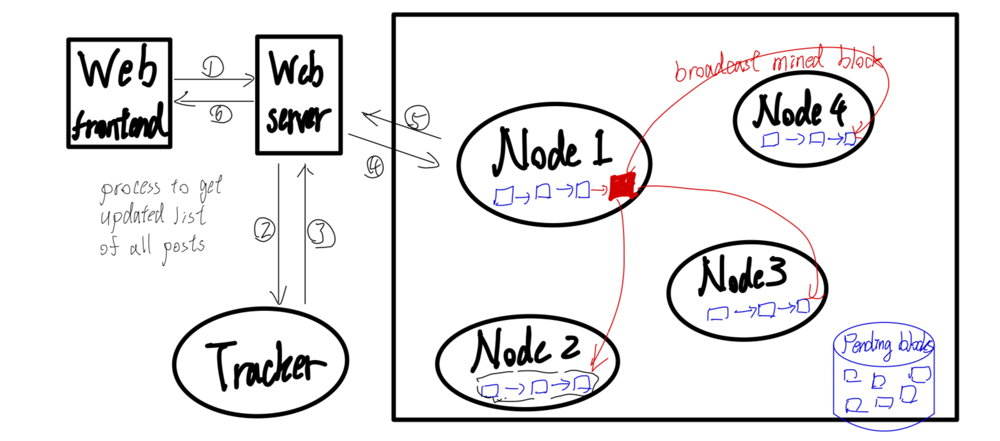

# Decentralized Social Media Application

## Demo Application Design
In this project, we will create a decentralized social media system, consisting of a blockchain of all social media posts on the system, maintained and developed by a P2P network. The following are some key functionalities of our system:
- **Post Creation**: users can post content, which is recorded as a block on the blockchain.
- **Cryptocurrency Coin Reward Mechanism**: system will reward a user with DSM-coin when his node successfully mined a valid block.
- **Donation for Liked Contents**: users can donate their DSM-coin rewards to a post's author, which becomes a transaction-type pending block.

## Design Overview
### 1. Block structure: 
In our system, there are two types of block. One is `post-type` that represents a post, with the signature signed by the author. The other is `transaction-type` that represents a cryptocurrency transaction (either DSM-coin reward from coinbase or donation from other user), with the signature signed by the sender.
```
Header                    Body
+-+-+-+-+-+-+-+-+-+-+-+-+ +-+-+-+-+-+-+-+-+-+-+-+-+
|   prev_hash   (256)   | |       data  (N)       |
|   signature   (256)   | +-+-+-+-+-+-+-+-+-+-+-+-+
|   type         (8)    |
|   nonce        (?)    |
+-+-+-+-+-+-+-+-+-+-+-+-+
```
- Header: includes previous block hash, producer's signature, and nonce
- Body: 
    - For the `post-type` block, it consists of the actual content of the post.
    - For the `transaction-type` block, it consists of the sender, recipient, and amount of the transaction.

### 2. System Architecture

- **Front-end GUI**: Hosts a responsive GUI to handle HTTP requests and render the whole list of posts.
- **Web Server**: Upon receiving an HTTP request, it interacts with the blockchain to retrieve the list of posts to render. Specifically, when the server receives a request to view posts, it contacts the tracker to obtain the address of the node who has the longest chain of blocks, extracts information on its chain of posts, and finially returns the list of posts to the front-end GUI.
- **Block Chain**: A decentralized chain of blocks containing all posts/transactions happened on the social media app. It is maintained and developed by all nodes in a P2P network.

### 3. P2P Network Protocol
- **Nodes**:
    - each node maintains a local copy of the whole block chain, a queue of pending blocks, and a list of peers.
    - continuously mine pending blocks in the queue.
    - once a node successfully mined a valid block
        - broadcast it to the whole P2P network.
        - recieve the reward DMS-coin through a transaction from coinbase.
- **Tracker**:
    - maintain a list of peer.
    - broadcast peer's join/leave to other peers.
    - maintain a table of users' public keys & finger prints.

### 4. Cryptography
- Hash functions: uses SHA-256 to generate cryptographic hashes for blocks.
- Asymmetric encryption: uses 256-byte RSA public/private key pairs to verify the identity of message senders, ensure data integrity and non-repudiation.
